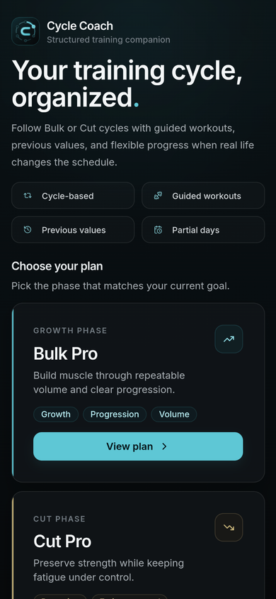
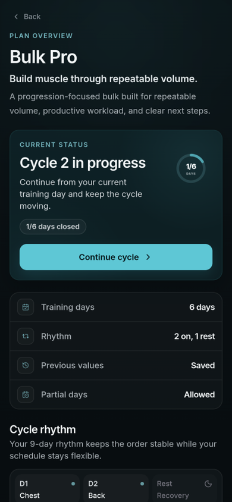
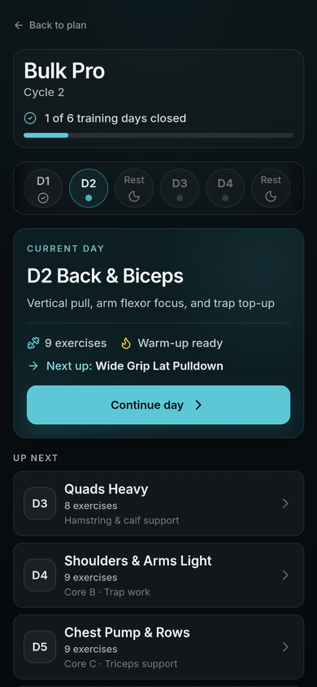
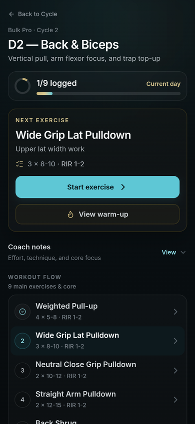
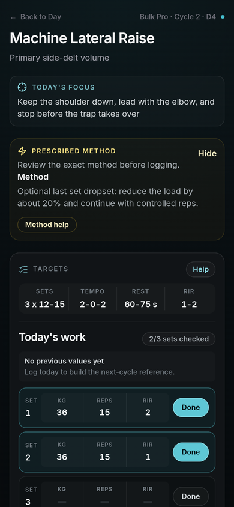
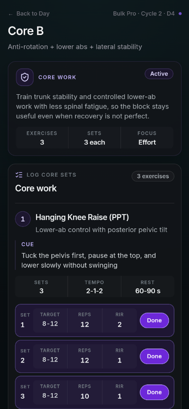
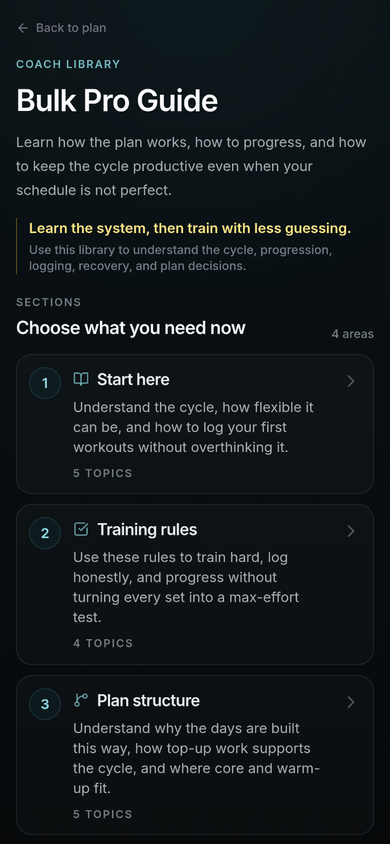
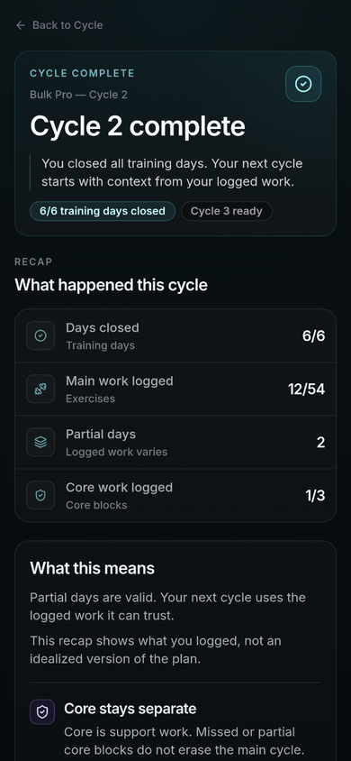

# Training App

A mobile-first, local-first React MVP built as a **structured training system**, not a generic workout tracker.

Training App combines two predefined plans — **Bulk Pro** and **Cut Pro** — with guided workout execution, contextual training support, set-by-set logging, previous-value continuity, and cycle-based progress in one clear flow.

The product is built around two connected principles:

```text
Clarity during the workout.
Continuity across the cycle.
```

Users can see what to do, how to perform it, what they logged previously, and what comes next. The cycle-based structure keeps the training order stable when real-life schedules change, without turning flexibility into random workout selection.

The current release is intentionally local-first and MVP-scoped. It focuses on proving the product flow, training-state model, persistence logic, and mobile workout experience before adding accounts, cloud sync, payments, or broader customization.

---

## Live Preview

Firebase Hosting preview:

```text
https://training-app-mvp.web.app
```

Current release:

```text
v0.5.0 — MVP Private Preview
```

The hosted app is a local-first MVP. It does not use accounts, cloud sync, backend persistence, or payment logic.

---

## Table of Contents

- [Overview](#overview)
- [Core Features](#core-features)
- [App Flow](#app-flow)
- [Technical Architecture](#technical-architecture)
- [Runtime State Model](#runtime-state-model)
- [Persistence Model](#persistence-model)
- [Static Data Structure](#static-data-structure)
- [Important Runtime Rules](#important-runtime-rules)
- [UI / UX Direction](#ui--ux-direction)
- [Project Structure](#project-structure)
- [Tech Stack](#tech-stack)
- [Running Locally](#running-locally)
- [Verification](#verification)
- [Screenshots](#screenshots)
- [Current Status](#current-status)
- [MVP Scope](#mvp-scope)
- [Known MVP Limitations](#known-mvp-limitations)
- [Future Improvements](#future-improvements)
- [What This Project Demonstrates](#what-this-project-demonstrates)
- [License](#license)

---

## Overview

Training App helps users follow a predefined training plan without turning every workout into manual planning, scattered notes, or guesswork.

The app brings the key information required to follow and execute the program into one workout flow:

- the active plan and current cycle
- the current training day
- exercise order
- prescribed sets and rep targets
- RIR, tempo, rest, and progression guidance
- contextual cues and training help
- set-by-set logging
- previous useful values
- the next meaningful step

The second core product value is continuity across the cycle.

Bulk Pro and Cut Pro use a stable D1–D6 training order inside a 9-day rhythm. When a workout is moved, missed, or completed only partially, the user does not need to rebuild the week, randomly skip work, or force several sessions into a compressed calendar.

The product principle is:

```text
The calendar can move.
The training order stays clear.
```

The MVP supports:

- choosing between two plans inside one structured training system: **Bulk Pro** and **Cut Pro**
- starting and continuing a training cycle
- following the current training day
- logging prescribed exercise sets
- logging separate core blocks
- finishing full or partial days honestly
- preserving useful previous values for the next cycle
- reviewing a completed cycle
- restoring progress after refresh through localStorage

The practical user outcome is:

```text
Know what to do.
Know how to do it.
Know what comes next.
```

---

## Core Features

### Structured training plans

The MVP includes two plans inside the same structured training system:

- **Bulk Pro** — progression-focused training with repeatable volume and productive workload
- **Cut Pro** — recovery-aware training focused on strength retention and fatigue control

Users choose the plan that matches their current training goal or phase.

The plans share the same application infrastructure:

- cycle flow
- guided workout screens
- set logging
- previous-value continuity
- partial-day behavior
- contextual guidance
- local persistence

They differ in training purpose, exercise selection, day emphasis, workload distribution, and progression mindset.

Bulk Pro and Cut Pro are plans within one product. Any future decision to unlock or sell them separately would be an access or monetization decision, not a change to the underlying product architecture.

### 6-day cycle inside a 9-day rhythm

The current cycle model is:

```text
D1 -> D2 -> Rest
D3 -> D4 -> Rest
D5 -> D6 -> Rest
```

The training order stays stable while rest days give the schedule room to breathe.

The cycle is not rigidly tied to Monday–Sunday labels. If real life moves a workout, the user continues from the next planned training day instead of rebuilding the week or choosing randomly.

This is controlled flexibility, not a free-form scheduler.

The system preserves:

- day order
- plan intent
- recovery spacing
- current-cycle orientation
- the next meaningful workout step

It does not automatically estimate fatigue, prescribe adaptive recovery, or allow arbitrary plan restructuring.

### Guided workout flow

The user moves through a clear app flow:

```text
Home
-> Plan Overview
-> Cycle Dashboard
-> Day
-> Exercise / Core
-> Finish Day
-> End Cycle recap
-> Start next cycle
```

The app keeps the current action and next meaningful step visible instead of asking the user to rebuild the training structure manually.

During execution, the product combines:

- day purpose
- exercise order
- prescribed targets
- RIR
- tempo
- rest
- progression rules
- contextual cues
- previous useful values
- current completion state

The information hierarchy follows a deliberate rule:

```text
Action first.
Guidance in context.
Deeper education when requested.
```

### Exercise logging

Main exercises support:

- prescribed set rows generated from explicit metadata
- weight input
- reps input
- RIR input
- performed-set checkbox
- exercise close intent
- active, finished, and preview states

Input values alone do not complete a set.

Only `isDone: true` marks a set as performed.

### Core block logging

Core work is integrated into selected training days and tracked separately from main exercise completion.

Core logging supports:

- reps-based core work
- time-based core work
- load tracking where relevant
- RIR tracking
- core block close intent
- separate core carry-over behavior

Core progress supports the training system but does not affect main day progress.

### Partial-day support

The app allows users to finish a day even when the day was partial.

This is intentional product behavior, not a missing validation rule.

A finished day means the user intentionally moved the cycle forward. It does not claim that every prescribed exercise or set was perfectly completed.

This prevents the app from forcing false completion and supports real situations such as:

- limited workout time
- unexpected interruptions
- fatigue
- skipped optional work
- sessions that could not be completed as planned

The system records what actually happened, preserves the cycle order, and keeps the next step clear.

### Previous-value carry-over

Completed set values can become useful references for the next cycle.

Carry-over is field-by-field and only uses values from performed sets.

The app does not carry forward:

- completion state
- closed state
- finished day state
- completed cycle state

### localStorage persistence

Runtime progress is saved locally through a dedicated storage layer.

The app restores:

- selected plan
- current cycle
- current day pointer
- day logs
- exercise logs
- core logs
- set values
- set done state
- close/finish/completion timestamps
- carry-over reference data

Static source data is not copied into localStorage.

### Educational training layer

The MVP includes a static educational layer that supports workout execution without turning every screen into a long manual.

The guidance layer covers:

- plan logic and cycle structure
- RIR and effort management
- tempo and rest targets
- progression rules
- exercise cues
- recovery and fatigue control
- warm-up guidance
- advanced technique explanations
- contextual exercise help

Education is split by context:

- **Home** explains the product value quickly.
- **Guide** explains the larger training system.
- **Exercise help** explains working rules such as tempo, rest, RIR, and progression.
- **Coach Notes and cues** provide short execution reminders near the current exercise.
- **Advanced technique help** explains methods such as dropsets, rest-pause, cluster work, mechanical sets, and stretch-focused work.
- **Warm-up sheets** provide short day-specific preparation guidance.

The product uses progressive disclosure:

```text
Essential targets stay visible.
Additional help appears in context.
Deeper explanations remain available on demand.
```

This content is guidance-only. It does not affect runtime completion, set status, cycle progress, or localStorage state.

The current MVP does not attempt to replace a complete exercise-form video library, individual coaching, medical advice, or professional assessment.

---

## App Flow

### Main routes

```text
/                        -> HomePage
/plan/:planId            -> PlanOverviewPage
/plan/:planId/cycle      -> CyclePage
/plan/:planId/day/:dayId -> DayPage
/plan/:planId/day/:dayId/exercise/:exerciseId -> ExercisePage
/plan/:planId/day/:dayId/core/:coreId         -> CorePage
/plan/:planId/guide      -> GuidePage
/plan/:planId/end-cycle  -> EndCyclePage
*                        -> fallback route
```

### Screen roles

| Screen | Role |
| --- | --- |
| Home | Product entry, plan choice, value explanation |
| Plan Overview | Plan context, rhythm explanation, start/continue/review cycle |
| Cycle Dashboard | Current cycle overview and next training day |
| Day | Workout command center for the selected day |
| Exercise | Main exercise logging and execution guidance |
| Core | Flexible core support workflow |
| Warm-up Sheet | Short pre-workout guidance |
| Guide | Deeper plan and training-system education |
| Finish Day Sheet | Close the current day with partial-day support |
| End Cycle | Runtime-derived cycle recap and next-cycle transition |

Warm-up and Finish Day are sheet flows opened from the Day screen, not standalone routes.

---

## Technical Architecture

The app is built with:

- React
- Vite
- Tailwind CSS
- React Router
- Context + reducer runtime state
- localStorage persistence
- Motion for UI transitions
- Lucide icons
- Firebase Hosting
- GitHub Actions CI

The architecture separates static training content from runtime user progress.

```text
Static source data = what the app prescribes
Runtime state      = what the user selected, logged, finished, or carried forward
```

This separation keeps the training system stable while allowing user progress to change independently.

---

## Runtime State Model

Global app state is managed with Context + reducer.

High-level state shape:

```js
{
  selectedPlanId: null,
  progressByPlan: {}
}
```

Progress is separated per plan so Bulk Pro and Cut Pro do not share cycle state.

Runtime state includes:

- selected plan
- active cycle
- cycle history
- current day pointer
- day logs
- main exercise logs
- core block logs
- set input values
- set done state
- exercise/core close intent
- day finish intent
- cycle completion
- previous-value carry-over references

The reducer owns state transitions. Persistence stays outside the reducer.

---

## Persistence Model

The app uses one dedicated localStorage layer:

```text
src/storage/appStateStorage.js
```

Storage key:

```js
"training-app:v1:app-state"
```

Stored wrapper:

```js
{
  version: 1,
  savedAt: "ISO timestamp",
  state: {
    selectedPlanId: null,
    progressByPlan: {}
  }
}
```

The storage layer handles:

- loading saved state
- saving runtime state
- clearing saved progress
- falling back safely when storage is missing, invalid, outdated, or broken

The reducer does not access localStorage directly.

---

## Static Data Structure

Training content is stored as static source data.

High-level structure:

```text
src/data/
  plans/
  days/
  dayDetails/
  exercises/
  core/
  warmups/
  guides/
  contextualHelp/
```

Static data owns:

- plan names and descriptions
- training day structure
- exercise definitions
- core block definitions
- warm-up content
- guide content
- contextual help content

Runtime state stores only user progress and user-entered values.

---

## Important Runtime Rules

### `prescription` is display copy

The app does not parse user-facing prescription strings.

```text
prescription = user-facing display text
setCount     = runtime scaffold metadata
```

Example:

```js
{
  id: "smith-bench-press",
  prescription: "4 x 5-7",
  setCount: 4
}
```

Core exercises also use metadata such as:

```js
{
  logType: "reps" | "time",
  tracksLoad: true | false
}
```

### Set completion is explicit

Input values do not complete a set.

```text
Set checkbox = what was actually performed
Input values = details about what was performed
```

A set counts as performed only when:

```js
isDone === true
```

### Close intent does not fake completion

Close actions record user intent. They do not automatically complete unfinished work.

```text
Exercise closedAt = user intentionally closed that exercise workflow
Core block closedAt = user intentionally closed that core workflow
Day finishedAt = user intentionally closed the training day
Cycle completedAt = all six training days were closed
```

### Upcoming previews are read-only

Upcoming Day, Exercise, and Core views allow previewing the structure but do not create or mutate current-cycle logs.

### Carry-over is conservative

A value can carry over only when:

```text
the previous set was marked as performed
and the specific field is not empty
```

Unchecked edited values remain saved in the local log but are not eligible for future carry-over.

---

## UI / UX Direction

The MVP uses a dark, mobile-first product interface.

Design goals:

- serious
- structured
- calm
- training-focused
- fast to use during workouts
- product-like without being flashy

The interface is designed around workout clarity rather than feature density.

Product and information-hierarchy principles:

```text
Action first.
Guidance in context.
Deeper education when requested.
```

```text
Show the current step clearly.
Keep the next action visible.
Do not force false completion.
```

The app uses reusable UI primitives for layout, cards, buttons, sheets, and screen structure.

Important UI patterns:

- centered mobile-first app shell
- product screens for plan choice and explanation
- training screens for execution and logging
- bottom sheets for warm-up, help, and finish-day confirmation
- compact row-based set logging
- contextual help without leaving the workout flow
- read-only preview states for upcoming work
- distinct active, partial, complete, and finished states
- quiet utility actions such as reset local progress

Desktop is intentionally presented as a centered mobile-first app shell rather than a full dashboard layout.

---

## Project Structure

```text
src/
  app/
  components/
  data/
  pages/
  state/
  storage/
  styles/
  utils/
```

Key areas:

```text
src/app/                 Router and app-level layout helpers
src/pages/               Route-level screens
src/components/          Shared and feature-specific UI components
src/data/                Static training content
src/state/               Context + reducer runtime state
src/storage/             localStorage persistence layer
src/styles/              UI tokens and motion presets
src/utils/runtime/       Runtime helper logic
```

---

## Tech Stack

### Runtime

- React
- React DOM
- React Router
- Tailwind CSS
- Motion
- Lucide React

### Tooling

- Vite
- ESLint
- GitHub Actions
- Firebase Hosting

### Package manager

This project uses npm and includes a committed `package-lock.json`.

---

## Running Locally

Recommended environment:

```text
Node.js 20+
npm
```

Install dependencies:

```bash
npm install
```

Start development server:

```bash
npm run dev
```

Run lint:

```bash
npm run lint
```

Create production build:

```bash
npm run build
```

Preview production build locally:

```bash
npm run preview
```

---

## Verification

Current release verification included:

```bash
npm run lint
npm run build
git diff --check
npm audit
```

Release status:

```text
lint passed
production build passed
git diff check passed
npm audit found 0 vulnerabilities
Firebase Hosting deploy verified
live mobile smoke test passed
deep route refresh checked
localStorage persistence checked after refresh
```

Build note:

Vite may report a chunk-size warning above 500 kB after production build. This is currently accepted as a non-blocking MVP limitation and can be revisited post-MVP with route-level code splitting if needed.

---

## Screenshots

The screenshots below show the main MVP flow using the mobile-first app layout. Each thumbnail links to the full screenshot.

<p>
  <a href="docs/screenshots/home.png"></a>
  <a href="docs/screenshots/plan-overview.png"></a>
  <a href="docs/screenshots/cycle-dashboard.png"></a>
  <a href="docs/screenshots/day-screen.png"></a>
</p>

<p>
  <a href="docs/screenshots/exercise-logging.png"></a>
  <a href="docs/screenshots/core-workflow.png"></a>
  <a href="docs/screenshots/guide.png"></a>
  <a href="docs/screenshots/end-cycle.png"></a>
</p>

---

## Current Status

```text
v0.5.0 — MVP Private Preview
```

The local-first MVP is implemented, deployed, tagged, and prepared for private preview / launch-style testing.

Completed:

- runtime workout flow
- localStorage persistence
- final product UI polish
- security dependency update
- branch cleanup
- release tag
- GitHub Release
- live deploy smoke test

---

## MVP Scope

This MVP includes:

- Bulk Pro and Cut Pro plans inside one structured training system
- 6-day cycle inside a 9-day rhythm
- guided workout flow
- main exercise logging
- core block logging
- previous-value carry-over
- partial-day support
- runtime-derived cycle recap
- localStorage persistence
- reset local progress
- mobile-first UI

This MVP does not include:

- authentication
- Firestore
- Cloud Functions
- cloud sync
- multi-device sync
- payments
- subscription or unlock logic
- AI coaching
- adaptive programming
- custom plan builder
- custom exercise substitutions
- analytics dashboard
- nutrition tracking
- cardio tracking
- PWA install flow
- full desktop dashboard layout

---

## Known MVP Limitations

Accepted current limitations:

- Progress is local to the browser/device.
- Clearing browser storage removes saved progress.
- Desktop uses a centered mobile-first app shell, not a full desktop layout.
- Phone landscape is usable but not optimized.
- The app is not a PWA yet.
- Vite may show a non-blocking chunk-size warning.
- No automated test suite is included yet.
- Private preview feedback may uncover UX issues that should become post-MVP backlog items.

---

## Future Improvements

Possible post-MVP directions:

- PWA / standalone install experience
- auth and cloud sync
- custom plan builder
- controlled exercise substitutions that preserve movement role and cycle logic
- rest timer
- deeper analytics
- training history charts
- machine setup guidance
- rest/LISS module
- improved desktop layout
- expanded screenshots and portfolio case study
- automated test coverage

These are intentionally outside the current local-first MVP scope.

---

## What This Project Demonstrates

This project was built as a complete product-style MVP, not only as a UI prototype or workout logging demo.

### Product and UX thinking

- turning training-domain rules into a clear user flow
- defining one structured system with two plan options
- combining prescribed structure with controlled schedule flexibility
- designing for real-life interruptions and partial workouts
- keeping the current and next meaningful actions visible
- separating essential workout information from optional deeper education
- using contextual guidance and progressive disclosure
- modeling honest partial completion instead of forcing perfect states
- maintaining a clear MVP boundary around local-first behavior

### Frontend architecture

- React app architecture with route-based screens
- Context + reducer state management
- separation of static source data and runtime user progress
- reducer-driven workout lifecycle transitions
- versioned localStorage persistence and hydration
- safe fallback behavior for invalid stored state
- conservative previous-value carry-over logic
- explicit completion modeling through performed-set checkboxes
- route-safe active, finished, and upcoming workout states
- reusable UI primitives and mobile-first interface design

### Delivery and engineering discipline

- structured project documentation
- staged MVP development
- lint and production-build verification
- Firebase Hosting deployment
- GitHub Actions CI
- explicit scope decisions, accepted limitations, and post-MVP boundaries

---

## License

No open-source license has been selected yet.

This repository is shared for review and portfolio purposes. The project may evolve beyond the MVP into a commercial product, so reuse, redistribution, or derivative work is not permitted without permission.